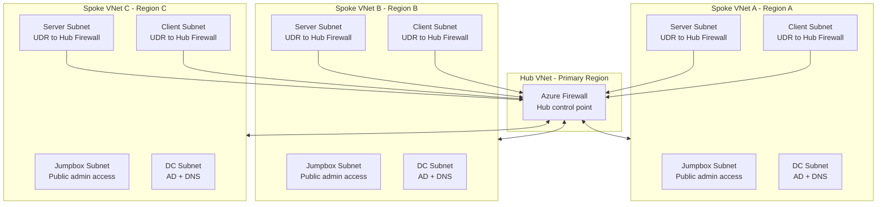

# Azure Multi-Region Lab (AMRL) v1.11

## Overview

This project implements a multi-region Azure lab environment using Bicep. It demonstrates a structured evolution from basic infrastructure deployment into a secure, modular, capacity-aware, and production-aligned platform.

The lab is designed to showcase real-world Infrastructure as Code practices, including:

- Deterministic and repeatable deployments  
- Modular architecture using reusable components  
- Secure-by-default design principles  
- Controlled workload distribution across multiple regions  
- Validation-first deployment to prevent configuration errors

---

## Table of Contents

- [Overview](#overview)
  - [Project Evolution](#project-evolution)
  - [Design Principles](#design-principles)

- [Architecture Overview](#architecture-overview)
  - [Regional Architecture](#regional-architecture)
  - [Network Architecture](#network-architecture)
  - [Network Architecture Diagram](#network-architecture-diagram)
  - [Traffic Flow](#traffic-flow)
  - [IP Addressing Strategy](#ip-addressing-strategy)
  - [DNS Configuration](#dns-configuration)
  - [Security Model](#security-model)
  - [Workload Distribution](#workload-distribution)

- [File Structure](#file-structure)
  - [Root Files](#root-files)
  - [Modules](#modules)
    - [Networking](#networking)
    - [Compute](#compute)
    - [Peering](#peering)
  - [Supporting Logic in main.bicep](#supporting-logic-in-mainbicep)
  - [Foundation Layer (External)](#foundation-layer-external)

- [Start Guide](#start-guide)
  - [Step 1: Understand the Core Concept](#step-1-understand-the-core-concept)
  - [Step 2: Core Deployment Settings](#step-2-core-deployment-settings)
  - [Step 3: Region Mapping (VERY IMPORTANT)](#step-3-region-mapping-very-important)
  - [Step 4a: Subnet Mapping](#step-4a-subnet-mapping)
  - [Step 4b: deploySubnets (IMPORTANT)](#step-4b-deploysubnets-important)
  - [Step 5: VM Counts (Controls Scale)](#step-5-vm-counts-controls-scale)
  - [Step 6: VM Size (CRITICAL)](#step-6-vm-size-critical)
  - [Step 7: Jumpbox Allowed Sources](#step-7-jumpbox-allowed-sources)
  - [Step 8: Key Vault Setup (Required)](#step-8-key-vault-setup-required)
  - [Step 9: Deploy](#step-9-deploy)
  - [Step 10: Validate Results](#step-10-validate-results)

- [Placement Engine](#placement-engine)
  - [Rules](#rules)
  - [Offset-Based Placement (IMPORTANT)](#offset-based-placement-important)
  - [Why this matters](#why-this-matters)

- [Validation](#validation)

- [Outputs](#outputs)

- [Final Tip](#final-tip)

---

### Project Evolution

The solution was developed iteratively, with each phase introducing additional architectural capability:

- **v1.6 — Foundation Layer**  
  Multi-region networking, subnet segmentation, and DNS structure.

- **v1.7 — Security and Modularity**  
  Network Security Groups, role-based segmentation, and VNet peering.

- **v1.8 — Modular Architecture**  
  Separation of components into reusable modules and integration with Azure Key Vault.

- **v1.9 — Security Hardening and Identity**  
  Introduction of a jumpbox model, private-only workloads, hub firewall routing, and hardened authentication.

- **v1.10 — Placement and Validation Engine**  
  Deterministic VM placement, predictable network addressing, capacity-aware distribution, route-table driven traffic control, and pre-deployment validation.

- **Current Version v1.11 — Hub-Spoke Networking**  
  Hub-and-spoke VNet peering combined with centralized firewall-based routing, spoke route tables, and refined network flow control across regions.

---

### Design Principles

The design is based on the following principles:

- **Deterministic deployment**  
  The same inputs always produce the same infrastructure layout.

- **Separation of concerns**  
  Networking, compute, security, and placement logic are clearly separated.

- **Data-driven design**  
  Deployment behaviour is controlled through parameter configuration.

- **Validation before deployment**  
  Invalid configurations are detected and blocked early.

- **Balanced multi-region distribution**  
  Workloads are evenly distributed while respecting regional constraints.

- **Security-first approach**  
  Minimal exposure, controlled access paths, and secure credential handling.

  [Back to top](#table-of-contents)

---

## Architecture Overview

The deployment creates a consistent infrastructure footprint across multiple Azure regions.

### Regional Architecture

Each selected region contains:

- A dedicated Resource Group  
- A Virtual Network (VNet)  
- Segmented subnets:
  - Domain Controller (dc)
  - Server
  - Client
  - Jumpbox  
- Network Security Groups (NSGs) applied per subnet  
- Virtual Machines based on configured roles  

  [Back to top](#table-of-contents)

---

### Network Architecture

- Spoke server and client subnets use user-defined routes (UDRs) to direct traffic through the hub firewall
- Hub firewall provides centralized east-west traffic inspection and acts as the control point for inter-region communication
- Controlled administrative access via regional jumpboxes (only tier with public exposure)
- Subnet-level traffic segmentation enforced using Network Security Groups (NSGs)

This design enforces centralized security by preventing direct spoke-to-spoke communication and routing all inter-network traffic through the hub firewall.

### Network Architecture Diagram



Traffic path: Spoke VM -> UDR -> Hub Firewall -> Destination Spoke VM (no direct spoke-to-spoke path).


  [Back to top](#table-of-contents)

---

### Traffic Flow

Spoke workloads do not talk directly to each other by default. Instead:

- Server and client subnets in spoke regions use route tables to send internal traffic to the hub firewall
- The hub firewall applies the central routing and security control point
- Jumpboxes remain the entry point for administration
- NSGs still enforce subnet-level access rules

  [Back to top](#table-of-contents)

---

### IP Addressing Strategy

All virtual machines use **Dynamic private IP allocation**.

Domain Controllers are deployed into dedicated **DC subnets per region**. Azure assigns IP addresses deterministically within each subnet:

- `.0–.3` are reserved by Azure  
- `.4` is the first usable IP address  

Because Domain Controllers are deployed first into their subnets, each region’s primary DC consistently receives the `.4` address.

This removes the need for complex static IP calculations while maintaining predictable addressing.

---

### DNS Configuration

Each Virtual Network is configured with up to three DNS servers, using deterministic `.4` addresses from DC subnets.

The DNS server list is derived dynamically from domain controller placements and ordered as follows:

1. The hub region DC (`.4`) is prioritised when present
2. Remaining regions containing DCs are included in deterministic order
3. The list is truncated to a maximum of three DNS servers

This same ordered DNS server list is applied consistently across all VNets.

### Design Approach

DNS configuration is based on deterministic infrastructure behavior rather than dynamic discovery:

- Bicep does not support runtime lookup of assigned IP addresses
- Each DC subnet is isolated and contains only Domain Controllers
- The first deployed VM in each subnet always receives `.4`
- Domain Controllers are deployed first, ensuring correct assignment

### Behaviour

- DNS order is hub-first, then remaining DC regions
- A VNet may have 1, 2, or 3 DNS entries depending on DC placement and region count
- DNS redundancy is maintained by including multiple regional DCs when available

### Active Directory Integration

After AD DS installation:

- Domain Controllers automatically register themselves in DNS
- Clients can discover all DCs using AD-integrated DNS

---

### Security Model

- Public access is restricted to jumpboxes only  
- All other VMs are private  
- Role-based NSG rules control traffic flow  
- Credentials are securely stored in Azure Key Vault  

  [Back to top](#table-of-contents)

---

### Workload Distribution

- Domain Controllers are placed first using deterministic rules  
- Remaining VMs use deterministic round-robin candidate placement with hub-avoidance for non-control workloads  
- Each region is constrained by a maximum VM limit to prevent over-allocation  

  [Back to top](#table-of-contents)

---

## File Structure

The project is structured to separate concerns and promote modular reuse.

---

### Root Files

- **main.bicep**  
  Entry point for the deployment. Defines orchestration, placement logic, validation, and module calls.

- **main.parameters.json**  
  Contains all configurable inputs such as regions, VM counts, and sizes.

---

### Modules

#### Networking

- **modules/networking/vnet.bicep**  
  Deploys VNets, integrates subnets, configures DNS, and supports both greenfield and brownfield network reuse.

- **modules/networking/subnet.bicep**  
  Defines individual subnet resources.

- **modules/networking/nsg.bicep**  
  Deploys Network Security Groups with role-based rules.

- **modules/networking/firewall.bicep**  
  Deploys the hub firewall and policy-based rule collections.

- **modules/networking/routeTable.bicep**  
  Attaches user-defined routes to spoke subnets so traffic reaches the hub firewall.

---

#### Compute

- **modules/compute/vm-windows.bicep**  
  Deploys Windows virtual machines, including Domain Controllers, servers, clients, and jumpboxes.

- **modules/compute/vm-linux.bicep**  
  Deploys Linux virtual machines with SSH-based authentication.

---

#### Peering

- **modules/peering/peering.bicep**  
  Configures hub-to-spoke and spoke-to-hub VNet peering.

---

### Supporting Logic in main.bicep

- **VM Model Construction**  
  Builds a unified list of all VM types and counts

- **Region Ordering Logic**  
  Converts region mappings into a deterministic ordered list

- **Placement Engine**  
  Assigns each VM to a region using deterministic candidate placement with explicit hub pinning and hub-avoidance rules

- **Validation Engine**  
  Ensures that configuration is valid before deployment begins

---

### Foundation Layer (External)

- Azure Key Vault (must exist before deployment)  
- Stores admin credentials securely  
- Referenced directly from the parameter file

  [Back to top](#table-of-contents)

---

# Start Guide

This section explains exactly how to configure and run the deployment. Each parameter is explained so that you understand what it does, why it matters, and how to change it safely.

---

## Step 1: Understand the Core Concept

This deployment spreads Virtual Machines across multiple Azure regions while ensuring:

- No region gets too many VMs
- Distribution is balanced
- Certain roles (like Domain Controllers) are placed intentionally

To control this behaviour, you configure a few key parameters in `main.parameters.json`.

---

## Step 2: Core Deployment Settings

```json
"prefix": { "value": "your-prefix" },
"regionCount": { "value": 5 },
"maxVmsPerRegion": { "value": 2 }
```

### 🔹 prefix
- Used to name all resources (e.g. `yourprefix-rg-westeurope`)
- Change this to something meaningful for your lab or project

### 🔹 regionCount
- How many regions will be used
- MUST be less than or equal to the number of regions in `regionIndexMap`

### 🔹 maxVmsPerRegion
- The **maximum number of VMs allowed in each region**
- This protects you from exceeding Azure CPU quotas

Example:
If each VM uses 2 vCPUs and quota is 4:
```
maxVmsPerRegion = 2
```

---

## Step 3: Region Mapping (VERY IMPORTANT)

For example:

```json
"regionIndexMap": {
  "value": {
    "southafricanorth": 1,
    "southindia": 2,
    "japanwest": 3,
    "israelcentral": 4,
    "koreasouth": 5
  }
}
```

### What this does

- Defines WHICH regions are available
- Defines the ORDER of regions

### Why order matters

The placement engine uses this order to distribute VMs.

### Rules

- Must start at `1`
- Must increase by `1` each time
- No gaps allowed

---

## Step 4a: Subnet Mapping

```json
"subnetIndexMap": {
  "value": {
    "jumpbox": 1,
    "dc": 2,
    "server": 3,
    "client": 4
  }
}
```

### What this does

Defines how subnets are created and ordered within each region.

The numbering determines:
- The logical order of subnets
- The subnet index used when calculating IP address ranges

### Recommendation

Leave these values as-is unless redesigning networking.

---

## Step 4b: `deploySubnets` (IMPORTANT)

```json
"deploySubnets": { "value": true }
```

### What this does

This switch controls whether the networking modules create subnets and NSGs, or whether they expect those resources to already exist.

### Behaviour

- `true` = create the subnets and NSGs as part of the deployment
- `false` = reuse existing subnets and NSGs instead of creating them

### Why it matters

For a fresh lab deployment, `deploySubnets` must stay `true`. If you set it to `false` without pre-existing subnets, the deployment will fail when VMs or the firewall try to reference subnets that do not exist yet.

### When to use `false`

Only use `false` if you have already built the VNet, subnets, and NSGs separately and want the lab to attach to that existing network.

---

## Step 5: VM Counts (Controls Scale)

```json
"vmCounts": {
  "value": {
    "dc": 2,
    "jumpbox": 2,
    "windowsServer": 2,
    "windowsClient": 1,
    "linuxServer": 2,
    "linuxClient": 1
  }
}
```

### What this does

Defines HOW MANY VMs of each type to create.

### Important behaviour

- Domain Controllers (dc) are placed first
- Jumpboxes are placed early in distribution
- Other VMs follow round-robin placement

### How to change safely

If you increase VM counts:

Ensure:
```
totalVMs ≤ regionCount × maxVmsPerRegion
```

---

## Step 6: VM Size (CRITICAL)

```json
"vmSize": { "value": "Standard_B2ls_v2" }
```

### What this does

Defines the size of every VM (CPU + RAM).

### Why this matters

Azure limits vCPU per region.

Example:

- VM size = 2 cores
- Region quota = 4 cores

Max safe:
```
2 VMs per region
```

---

## Step 7: Jumpbox Allowed Sources

```json
"jumpboxAllowedSources": {
  "value": [
    "198.51.100.25",
    "203.0.113.0/24"
  ]
}
```

### What this does

Defines the list of public IP addresses or ranges that are allowed to access the jumpboxes via RDP. These values are used to configure inbound Network Security Group (NSG) rules, restricting administrative access to only the specified sources.

---

### Important

- Replace these example IP addresses with your own public IP address(es) or range(s)
- If not configured correctly, you will not be able to access the jumpboxes
- Jumpboxes are the only entry point to access the rest of the virtual machines in the environment

---

## Step 8: Key Vault Setup (Required)

### Why Key Vault is needed

Passwords are NOT stored in the template.
They are securely stored in Azure Key Vault.

---

### Create Foundation Resource Group

```bash
az group create --name traininglab-rg-foundation --location westeurope
```

Ensure that the name of this resource group does not start with the prefix selected earlier, as it will also be deleted if a bulk resource group deletion command is used to cleanup the lab.

---

### Create Key Vault

```bash
az keyvault create   --name traininglab-kv   --resource-group traininglab-rg-foundation   --location westeurope   --enabled-for-template-deployment true
```

---

### Add Secrets

```bash
az keyvault secret set --vault-name traininglab-kv --name jumpboxAdminPassword --value <password>
az keyvault secret set --vault-name traininglab-kv --name serverAdminPassword --value <password>
az keyvault secret set --vault-name traininglab-kv --name clientAdminPassword --value <password>
```

---

### Link Key Vault in Parameters

```json
"jumpboxAdminPassword": {
  "reference": {
    "keyVault": {
      "id": "/subscriptions/<subId>/resourceGroups/traininglab-rg-foundation/providers/Microsoft.KeyVault/vaults/traininglab-kv"
    },
    "secretName": "jumpboxAdminPassword"
  }
}
```

Repeat for other passwords.

---

## Step 9: Deploy

```bash
az deployment sub create   --name amrl-deployment   --location westeurope   --template-file main.bicep   --parameters main.parameters.json
```

---

## Step 10: Validate Results

After deployment validation (or during development), review the outputs to confirm correctness and troubleshoot issues.

### Key Outputs

- `vmPlacement`  
  Shows where each VM is deployed across regions.  
  Use this to verify deterministic placement logic.

- `vmCountPerRegion`  
  Displays VM distribution per region.  
  Confirms that no region exceeds capacity limits.

- `validationMessage`  
  Provides a human-readable explanation of the first validation failure (empty if valid).

- `validationDebug`  
  Displays detailed validation flags for all rules.  
  Useful during development to identify exactly which condition failed.

- `capacityCheck`  
  Shows total requested VMs vs total available capacity.

---

### How to Use These Outputs

1. Check `validationMessage` for a quick explanation  
2. Use `validationDebug` to see which rule failed  
3. Review `vmPlacement` and `vmCountPerRegion` to validate distribution logic  

---

### Note

During development, validation errors are exposed via outputs instead of blocking deployment.  
In production scenarios, assertions can be enabled to prevent invalid deployments.

---

# Final Tip

If deployment validation fails or produces unexpected results:

1. Check `validationMessage` for a high-level explanation  
2. Inspect `validationDebug` to identify the exact failing condition  
3. Validate VM distribution using:
   - `vmPlacement`
   - `vmCountPerRegion`  

4. Verify configuration inputs:
   - VM sizes vs regional quota  
   - `regionCount` vs available regions  
   - `vmCounts` vs total capacity  

5. Confirm Key Vault configuration and secret references  

---

### Important

Validation is designed to catch errors **before deployment**.  
Use the outputs to fix configuration issues rather than troubleshooting failed resources.

  [Back to top](#table-of-contents)

---

# Placement Engine

## Rules

1. dc01 → primary region
2. jmp01 → primary region
3. all remaining VMs → round-robin candidate across regions
4. non-control VMs (not dc/jmp) are redirected away from hub when candidate lands in hub

---

## Offset-Based Placement (IMPORTANT)

Current placement behavior:

```
candidateRegion = regionKeys[roundRobinVmIndex % regionCount]

if candidateRegion == primaryRegion and vmType not in [dc, jmp]:
  finalRegion = regionKeys[(roundRobinVmIndex % (regionCount - 1)) + 1]
else:
  finalRegion = candidateRegion
```

---

## Why this matters

- Control-plane placement stays deterministic (dc01 and jmp01 pinned to hub)
- Non-control workloads are prevented from accumulating in hub
- Regional spread remains predictable and capacity checks still apply

---

# Validation

The deployment includes a validation engine that ensures configuration correctness before resources are provisioned.

### Validation Rules

The following checks are performed:

- Minimum required VM counts (at least 1 DC and 1 jumpbox)  
- Region count does not exceed available mappings  
- Jumpbox count does not exceed region count  
- Total VM count does not exceed regional capacity  
- All regions defined in `regionKeys` exist in `regionIndexMap`  
- Subnet index map includes required roles (dc, jumpbox, server, client)  
- Region index values are continuous and start at 1  
- No region exceeds the maximum VM capacity  
- Domain Controller distribution fits within region constraints  

---

### Validation Outputs

Validation results are exposed using:

- `validationMessage` → first detected validation issue  
- `validationDebug` → detailed boolean values for all validation checks  

---

# Outputs

The deployment provides several outputs to assist with validation, debugging, and verification.

### Core Outputs

- `vmPlacement`  
  Detailed mapping of all VMs to regions  

- `vmCountPerRegion`  
  Number of VMs deployed per region  

- `validationMessage`  
  Human-readable validation error (empty if valid)  

- `validationDebug`  
  Detailed validation flags for all rules  

- `capacityCheck`  
  Summary of total requested VMs vs available capacity  

- `selectedRegionsOutput`  
  List of regions used in deployment  

- `totalVmRequested`  
  Total number of VMs requested  

- `totalCapacityAvailable`  
  Maximum allowed VMs based on configuration  

---

### Purpose

These outputs are designed to:

- Validate deployment logic  
- Troubleshoot configuration issues  
- Confirm workload distribution  
- Provide insight into capacity usage  

---

### Best Practice

Always review validation outputs before proceeding with further configuration steps.

  [Back to top](#table-of-contents)

---