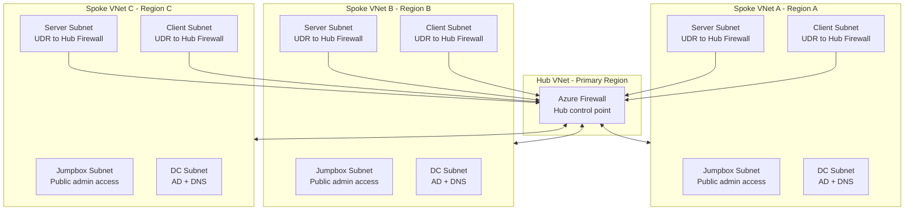

# Azure Multi-Region Lab (AMRL) v1.12

## Overview

This project implements a multi-region Azure lab environment using Bicep. It demonstrates a structured evolution from basic infrastructure deployment into a secure, modular, capacity-aware, and production-aligned platform.

The lab is designed to showcase real-world Infrastructure as Code practices, including:

- Deterministic and repeatable deployments  
- Modular architecture using reusable components  
- Secure-by-default design principles  
- Controlled workload distribution across multiple regions  
- Validation-first deployment to prevent configuration errors

---

## Table of Contents

<details open>
<summary><strong>Overview</strong></summary>

- [Overview](#overview)
  - [Project Evolution](#project-evolution)
  - [Design Principles](#design-principles)

</details>

<details>
<summary><strong>Design Decisions & Trade-offs</strong></summary>

- [Design Decisions & Trade-offs](#design-decisions--trade-offs)
  - [Deterministic `.4` DNS](#deterministic-4-dns)
  - [Index-Based Placement](#index-based-placement)
  - [Controlled Hub Placement for Control-Plane Workloads](#controlled-hub-placement-for-control-plane-workloads)
  - [Hub Role Restriction](#hub-role-restriction)
  - [Parallel Deployment Reality](#parallel-deployment-reality)
  - [Global DNS](#global-dns)

</details>

<details>
<summary><strong>Architecture Overview</strong></summary>

- [Architecture Overview](#architecture-overview)
  - [Regional Architecture](#regional-architecture)
  - [Network Architecture](#network-architecture)
  - [Network Architecture Diagram](#network-architecture-diagram)
  - [Traffic Flow](#traffic-flow)
  - [IP Addressing Strategy](#ip-addressing-strategy)
  - [DNS Configuration](#dns-configuration)
  - [Design Approach](#design-approach)
  - [Behaviour](#behaviour)
  - [Active Directory Integration](#active-directory-integration)
  - [Security Model](#security-model)
  - [Workload Distribution](#workload-distribution)

</details>

<details>
<summary><strong>File Structure</strong></summary>

- [File Structure](#file-structure)
  - [Root Files](#root-files)
  - [Modules](#modules)
    - [Networking](#networking)
    - [Compute](#compute)
    - [Peering](#peering)
    - [Logic](#logic)
  - [Supporting Logic in main.bicep](#supporting-logic-in-mainbicep)
  - [Foundation Layer (External)](#foundation-layer-external)

</details>

<details>
<summary><strong>Start Guide</strong></summary>

- [Start Guide](#start-guide)
  - [Step 1: Understand the Core Concept](#step-1-understand-the-core-concept)
  - [Step 2: Core Deployment Settings](#step-2-core-deployment-settings)
  - [Step 3: Region Mapping](#step-3-region-mapping)
  - [Step 4a: Subnet Mapping](#step-4a-subnet-mapping)
  - [Step 4b: Greenfield and Brownfield Deployments](#step-4b-greenfield-and-brownfield-deployments)
    - [deploySubnets](#deploysubnets)
    - [Greenfield Deployments](#greenfield-deployments)
    - [Brownfield Deployments](#brownfield-deployments)
    - [Relationship Between Stages and Brownfield Deployments](#relationship-between-stages-and-brownfield-deployments)
    - [Stage Dependency Considerations](#stage-dependency-considerations)
    - [Supported Deployment Models](#supported-deployment-models)
  - [Step 5: VM Counts (Controls Scale)](#step-5-vm-counts-controls-scale)
  - [Step 6: VM Size](#step-6-vm-size)
  - [Step 7: Jumpbox Allowed Sources](#step-7-jumpbox-allowed-sources)
  - [Step 8: Key Vault Setup (Required)](#step-8-key-vault-setup-required)
  - [Step 9: Deploy](#step-9-deploy)
    - [Full Deployment (Default)](#full-deployment-default)
    - [Network Stage](#network-stage)
    - [Control Stage](#control-stage)
    - [Workload Stage](#workload-stage)
    - [Recommended Deployment Order](#recommended-deployment-order)
  - [Step 10: Validate Results](#step-10-validate-results)

</details>

<details>
<summary><strong>Placement Engine</strong></summary>

- [Placement Engine](#placement-engine)
  - [Rules](#rules)
  - [Placement Decision Flow](#placement-decision-flow)
  - [Why this matters](#why-this-matters)

</details>

<details>
<summary><strong>Validation</strong></summary>

- [Validation](#validation)
  - [Validation Rules](#validation-rules)
  - [Validation Outputs](#validation-outputs)

</details>

<details>
<summary><strong>Outputs</strong></summary>

- [Outputs](#outputs)
  - [Core Outputs](#core-outputs)
  - [Purpose](#purpose)
  - [Best Practice](#best-practice)

</details>

<details>
<summary><strong>Future Plans</strong></summary>

- [Future Plans](#future-plans)

</details>

---

### Project Evolution

The solution was developed iteratively, with each phase introducing additional architectural capability:

- **v1.0 — IaC Baseline**  
  Introduced the initial Bicep-based multi-region deployment baseline with static VNet peering and CLI-driven execution.

- **v1.5 — Automation and Validation**  
  Standardised and automated subscription-scope deployments with repeatable validation and cross-region connectivity testing.

- **v1.6 — Core Network Foundation**  
  Multi-region networking, subnet segmentation, and DNS structure.

- **v1.7 — Security and Modularity**  
  Network Security Groups, role-based segmentation, and VNet peering.

- **v1.8 — Modular Architecture**  
  Separation of components into reusable modules and integration with Azure Key Vault.

- **v1.9 — Security Hardening and Identity**  
  Introduction of a jumpbox model, private-only workloads, hub firewall routing, and hardened authentication.

- **v1.10 — Placement and Validation Engine**  
  Deterministic VM placement, predictable network addressing, capacity-aware distribution, route-table driven traffic control, and pre-deployment validation.

- **v1.11 — Hub-Spoke Networking**  
  Hub-and-spoke VNet peering combined with centralised firewall-based routing, spoke route tables, and refined network flow control across regions.

- **Current Version v1.12 — Deployment Stage Control**  
  Introduces stage-driven deployment control (`network`, `control`, `workload`, `all`) while retaining hub-and-spoke peering, centralised firewall routing, and spoke route table enforcement.

---

### Design Principles

The design is based on the following principles:

- **Deterministic deployment**  
  The same inputs always produce the same infrastructure layout.

- **Separation of concerns**  
  Networking, compute, security, and placement logic are clearly separated.

- **Data-driven design**  
  Deployment behaviour is controlled through parameter configuration.

- **Validation before deployment**  
  Invalid configurations are detected and blocked early.

- **Balanced multi-region distribution**  
  Workloads are evenly distributed while respecting regional constraints.

- **Security-first approach**  
  Minimal exposure, controlled access paths, and secure credential handling.

  [Back to top](#table-of-contents)

---

## Design Decisions & Trade-offs

### Deterministic `.4` DNS
Use `.4` from each DC subnet for DNS.

- Benefit: Predictable and valid.  
- Limitation: Not all DC IPs are listed.  

---

### Index-Based Placement
Placement uses deterministic indexing instead of real capacity tracking.

- Benefit: Repeatable.  
- Limitation: Approximate, not dynamic.  

---

### Controlled Hub Placement for Control-Plane Workloads
The first Domain Controller and jumpbox are pinned to the hub region.  
Additional DCs and jumpboxes are placed in spokes first, with the hub used as a fallback.

- Benefit: Guarantees control-plane presence in the hub.  
- Benefit: Distributes additional instances for resilience.  
- Benefit: Protects limited hub capacity.  
- Benefit: Allows additional hub placement when capacity permits.  
- Limitation: Based on index ordering, not real-time capacity.  

---

### Hub Role Restriction
Only DCs and jumpboxes are allowed in the hub.

- Benefit: Clear control-plane separation.  
- Benefit: Improved security posture.  
- Limitation: Reduces general capacity in the hub.  

---

### Parallel Deployment Reality
Placement does not rely on deployment order.

- Benefit: Deterministic behaviour.  
- Limitation: Must account for concurrent deployments.  

---

### Global DNS
All VNets share the same DNS list derived from DC placement.

- Benefit: Simple and consistent.  
- Limitation: Not latency-optimised per region.  

  [Back to top](#table-of-contents)

## Architecture Overview

The deployment creates a consistent infrastructure footprint across multiple Azure regions.

### Regional Architecture

Each selected region contains:

- A dedicated Resource Group  
- A Virtual Network (VNet)  
- Segmented subnets:
  - Domain Controller (dc)
  - Server
  - Client
  - Jumpbox  
- Network Security Groups (NSGs) applied per subnet  
- Virtual Machines based on configured roles  

  [Back to top](#table-of-contents)

---

### Network Architecture

- Spoke server and client subnets use user-defined routes (UDRs) to direct traffic through the hub firewall
- Hub firewall provides centralised east-west traffic inspection and acts as the control point for inter-region communication
- Controlled administrative access via regional jumpboxes (only tier with public exposure)
- Subnet-level traffic segmentation enforced using Network Security Groups (NSGs)

This design enforces centralised security by preventing direct spoke-to-spoke communication and routing all inter-network traffic through the hub firewall.

### Network Architecture Diagram



Traffic path: Spoke VM -> UDR -> Hub Firewall -> Destination Spoke VM (no direct spoke-to-spoke path).

  [Back to top](#table-of-contents)

---

### Traffic Flow

Spoke workloads do not talk directly to each other by default. Instead:

- Server and client subnets in spoke regions use route tables to send internal traffic to the hub firewall
- The hub firewall applies the central routing and security control point
- Jumpboxes remain the entry point for administration
- NSGs still enforce subnet-level access rules

  [Back to top](#table-of-contents)

---

### IP Addressing Strategy

All virtual machines use **Dynamic private IP allocation**.

Domain Controllers are deployed into dedicated **DC subnets per region**. Azure assigns IP addresses deterministically within each subnet:

- `.0–.3` are reserved by Azure  
- `.4` is the first usable IP address  

Because Domain Controllers are deployed first into their subnets, each region’s primary DC consistently receives the `.4` address.

This removes the need for complex static IP calculations while maintaining predictable addressing.

---

### DNS Configuration

Each Virtual Network is configured with up to three DNS servers, using deterministic `.4` addresses from DC subnets.

The DNS server list is derived dynamically from domain controller placements and ordered as follows:

1. The hub region DC (`.4`) is prioritised when present
2. Remaining regions containing DCs are included in deterministic order
3. The list is truncated to a maximum of three DNS servers

This same ordered DNS server list is applied consistently across all VNets.

### Design Approach

DNS configuration is based on deterministic infrastructure behaviour rather than dynamic discovery:

- Bicep does not support runtime lookup of assigned IP addresses
- Each DC subnet is isolated and contains only Domain Controllers
- The first deployed VM in each subnet always receives `.4`
- Domain Controllers are deployed first, ensuring correct assignment

### Behaviour

- DNS order is hub-first, then remaining DC regions
- Each VNet may have between one and three DNS entries depending on DC placement and region count
- DNS redundancy is maintained by including multiple regional DCs when available

### Active Directory Integration

After AD DS installation:

- Domain Controllers automatically register themselves in DNS
- Clients can discover all DCs using AD-integrated DNS

---

### Security Model

- Public access is restricted to jumpboxes only  
- All other VMs are private  
- Role-based NSG rules control traffic flow  
- Credentials are securely stored in Azure Key Vault  

  [Back to top](#table-of-contents)

---

### Workload Distribution

- Domain Controllers are placed first using deterministic rules  
- Non-control workloads (server/client roles) are always placed on spoke regions  
- Additional DC/JMP workloads use spoke-first placement, then may use hub after the initial spoke-first placement pass (based on VM index)  
- Each region is constrained by a maximum VM limit to prevent over-allocation  

  [Back to top](#table-of-contents)

---

## File Structure

The project is structured to separate concerns and promote modular reuse.

---

### Root Files

- **main.bicep**  
  Entry point for the deployment. Defines orchestration, placement logic, and module calls.

- **main.parameters.example.json**  
  GitHub-safe sample parameter file with placeholder values for subscription IDs, Key Vault names, public keys, and source ranges. Copy or rename this file locally to create your own `main.parameters.json`.

---

### Modules

#### Networking

- **modules/networking/vnet.bicep**  
  Deploys VNets, integrates subnets, configures DNS, and supports both greenfield and brownfield network reuse.

- **modules/networking/subnet.bicep**  
  Defines individual subnet resources.

- **modules/networking/nsg.bicep**  
  Deploys Network Security Groups with role-based rules.

- **modules/networking/firewall.bicep**  
  Deploys the hub firewall and policy-based rule collections.

- **modules/networking/routeTable.bicep**  
  Attaches user-defined routes to spoke subnets so traffic reaches the hub firewall.

---

#### Compute

- **modules/compute/vm-windows.bicep**  
  Deploys Windows virtual machines, including Domain Controllers, servers, clients, and jumpboxes.

- **modules/compute/vm-linux.bicep**  
  Deploys Linux virtual machines with SSH-based authentication.

---

#### Peering

- **modules/peering/peering.bicep**  
  Configures hub-to-spoke and spoke-to-hub VNet peering.

---

#### Logic

- **modules/logic/validation.bicep**  
  Evaluates placement and configuration checks and emits validation outputs used by `main.bicep`.

---

### Supporting Logic in main.bicep

- **VM Model Construction**  
  Builds a unified list of all VM types and counts

- **Region Ordering Logic**  
  Converts region mappings into a deterministic ordered list

- **Placement Engine**  
  Assigns each VM to a region using role-aware deterministic placement with explicit hub pinning and spoke-first control-plane behaviour

- **Validation Engine**  
  Invokes `modules/logic/validation.bicep` and surfaces validation outputs at the top level

---

### Foundation Layer (External)

- Azure Key Vault (must exist before deployment)  
- Stores admin credentials securely  
- Referenced directly from the parameter file

  [Back to top](#table-of-contents)

---

# Start Guide

This section explains exactly how to configure and run the deployment. Each parameter is explained so that you understand what it does, why it matters, and how to change it safely.

---

## Step 1: Understand the Core Concept

This deployment spreads Virtual Machines across multiple Azure regions while ensuring:

- No region gets too many VMs
- Distribution is balanced
- Certain roles (like Domain Controllers) are placed intentionally

To control this behaviour, you configure a few key parameters in a `main.parameters.json` file.
Start by copying or renaming `main.parameters.example.json` to `main.parameters.json`, then edit the local copy with your own values.

---

## Step 2: Core Deployment Settings

```json
"prefix": { "value": "your-prefix" },
"regionCount": { "value": 5 },
"maxVmsPerRegion": { "value": 2 }
```

### 🔹 prefix
- Used to name all resources (e.g. `yourprefix-rg-westeurope`)
- Change this to something meaningful for your lab or project

### 🔹 regionCount
- How many regions will be used
- MUST be less than or equal to the number of regions in `regionIndexMap`

### 🔹 maxVmsPerRegion
- The **maximum number of VMs allowed in each region**
- Manual pre-check guidance: Use this to help plan around Azure CPU quotas. The template enforces VM count limits, not vCPU quota checks.

Example:
If each VM uses 2 vCPUs and quota is 4:
```
maxVmsPerRegion = 2
```

---

## Step 3: Region Mapping

For example:

```json
"regionIndexMap": {
  "value": {
    "southafricanorth": 1,
    "southindia": 2,
    "japanwest": 3,
    "israelcentral": 4,
    "koreasouth": 5
  }
}
```

### What this does

- Defines WHICH regions are available
- Defines the ORDER of regions

### Why order matters

The placement engine uses this order to distribute VMs.

### Rules

- Must start at `1`
- Must increase by `1` each time
- No gaps allowed

  [Back to top](#table-of-contents)

---

## Step 4a: Subnet Mapping

```json
"subnetIndexMap": {
  "value": {
    "firewall": 0,
    "jumpbox": 1,
    "dc": 2,
    "server": 3,
    "client": 4
  }
}
```

### What this does

Defines how subnets are created and ordered within each region.

The numbering determines:
- The firewall subnet index used for AzureFirewallSubnet in the hub VNet
- The logical order of subnets
- The subnet index used when calculating IP address ranges

### Recommendation

Leave these values as-is unless redesigning networking.

  [Back to top](#table-of-contents)

---

## Step 4b: Greenfield and Brownfield Deployments

### `deploySubnets`

```json
"deploySubnets": { "value": true }
```

This parameter controls whether networking resources are created or reused.

| Value | Behaviour |
|---------|------------|
| `true` | Creates NSGs, subnets, and the Azure Firewall subnet. |
| `false` | Reuses existing networking resources instead of creating them. |

---

### Greenfield Deployments

A greenfield deployment creates all networking components required by the solution:

- VNets
- Subnets
- NSGs
- Azure Firewall subnet
- Route tables
- Virtual machines

For new lab environments, leave `deploySubnets` set to `true`.

---

### Brownfield Deployments

A brownfield deployment reuses existing networking resources rather than creating new ones.

This solution supports deployment framework-managed brownfield scenarios, including:

- Redeployment of an existing environment.
- Recovery or rebuild of virtual machines.
- Incremental deployment of additional workloads.
- Separate execution of the `network`, `control`, and `workload` stages within environments created and managed by this deployment framework.

The existing networking resources should either:

- Have been created by a previous deployment of this solution, or
- Follow the same naming conventions, subnet structure, and resource relationships expected by the modules.

  [Back to top](#table-of-contents)

---

### Relationship Between Stages and Brownfield Deployments

Stages and brownfield support serve different purposes:

| Feature | Purpose |
|----------|---------|
| `stage` | Controls when resources are deployed |
| `deploySubnets` | Controls whether networking resources are created or reused |

Examples:

- `stage=network` → Deploy networking only.
- `stage=control` → Deploy control-plane virtual machines (Domain Controllers and jumpboxes) only.
- `stage=workload` → Deploy workload VMs only.
- `deploySubnets=false` → Reuse existing networking resources.

These features can be used independently or together, provided the required networking resources and deployment framework assumptions are already in place.

---

### Parameters That Can Be Changed Between Deployments

The following changes are generally supported:

- VM counts (`vmCounts`)
- VM sizes (`vmSize`)
- Operating system images (`windowsServerImage`, `windowsClientImage`, `ubuntuImage`)
- Administrative credentials
- SSH public keys
- Tags
- Jumpbox access restrictions (`jumpboxAllowedSources`)
- Client SSH settings (`enableClientSsh`)
- Deployment stage (`stage`)

Typical examples include:

- Increasing workload VM counts
- Adding additional Domain Controllers
- Updating operating system images
- Resizing virtual machines

---

### Changes Requiring Careful Planning

The following parameters may significantly affect topology or addressing:

- `prefix`
- `regionCount`
- `regionIndexMap`
- `subnetIndexMap` (including the `firewall` index)

Changing these values after deployment may require resource recreation or migration planning.

---

### Current Limitation

This solution is designed around the networking structure produced by its own modules.

The following scenarios are not currently supported without additional customization:

- Existing corporate VNets with different subnet structures
- Existing NSGs with different naming conventions
- Networking environments created by unrelated templates
- Arbitrary existing network topologies

### Stage Dependency Considerations

Control and workload deployments rely on networking structures defined by this deployment framework. While the stages can be executed independently after networking has been established, the current implementation is not intended for deploying compute resources into arbitrary pre-existing networking environments without additional customization.

---

### Supported Deployment Models

| Scenario | Supported |
|-----------|-----------|
| Greenfield deployment | Yes |
| Full deployment (`stage=all`) | Yes |
| Staged deployment (`network → control → workload`) within framework-managed environments | Yes |
| Redeploy existing environment created by this framework | Yes |
| Reuse existing networking that follows the framework structure | Yes |
| Disaster recovery and VM rebuilds | Yes |
| Modify VM counts, sizes, images, tags, and access settings | Yes |
| Deploy into arbitrary existing networking | No |

  [Back to top](#table-of-contents)

---

### Design Principle

The VNet module (`vnet.bicep`) is the authoritative source of truth for:

- Subnet creation
- NSG creation
- Subnet IDs
- NSG IDs

Other modules consume these outputs instead of reconstructing names or resource IDs. This prevents naming drift and ensures consistency across the deployment.

  [Back to top](#table-of-contents)

---

## Step 5: VM Counts (Controls Scale)

```json
"vmCounts": {
  "value": {
    "dc": 2,
    "jumpbox": 2,
    "windowsServer": 2,
    "windowsClient": 1,
    "linuxServer": 2,
    "linuxClient": 1
  }
}
```

### What this does

Defines HOW MANY VMs of each type to create.

### Important behaviour

- Domain Controllers (dc) are placed first
- The first jumpbox is pinned to the primary region
- Non-control VMs are kept on spokes, while additional DC/JMP VMs follow spoke-first placement before hub fallback

### How to change safely

If you increase VM counts:

Ensure:
```
totalVMs ≤ regionCount × maxVmsPerRegion
```

---

## Step 6: VM Size

```json
"vmSize": { "value": "Standard_B2ls_v2" }
```

### What this does

Defines the size of every VM (CPU + RAM).

### Why this matters

Manual pre-check: Azure limits vCPU per region.

Example:

- VM size = 2 cores
- Region quota = 4 cores

Max safe:
```
2 VMs per region
```

This is a planning check only. Actual quota validation must be done against your subscription and region before deployment.

  [Back to top](#table-of-contents)

---

## Step 7: Jumpbox Allowed Sources

```json
"jumpboxAllowedSources": {
  "value": [
    "<your-public-ip>",
    "<your-public-cidr-range>"
  ]
}
```

### What this does

Defines the list of public IP addresses or ranges that are allowed to access the jumpboxes via RDP. These values are used to configure inbound Network Security Group (NSG) rules, restricting administrative access to only the specified sources.

In the published example file, these values are placeholders. Replace them in your local `main.parameters.json` with your own public IP address or CIDR range.

---

### Important

- Replace these example IP addresses with your own public IP address(es) or range(s)
- If not configured correctly, you will not be able to access the jumpboxes
- Jumpboxes are the only entry point to access the rest of the virtual machines in the environment

  [Back to top](#table-of-contents)

---

## Step 8: Key Vault Setup (Required)

### Why Key Vault is needed

Passwords are NOT stored in the template.
They are securely stored in Azure Key Vault.

---

### Create Foundation Resource Group

```bash
az group create --name traininglab-rg-foundation --location westeurope
```

Ensure that the name of this resource group does not start with the prefix selected earlier, as it will also be deleted if a bulk resource group deletion command is used to clean up the lab.

---

### Create Key Vault

```bash
az keyvault create \
  --name traininglab-kv \
  --resource-group traininglab-rg-foundation \
  --location westeurope \
  --enabled-for-template-deployment true
```

---

### Add Secrets

```bash
az keyvault secret set --vault-name traininglab-kv --name jumpboxAdminPassword --value <password>
az keyvault secret set --vault-name traininglab-kv --name serverAdminPassword --value <password>
az keyvault secret set --vault-name traininglab-kv --name clientAdminPassword --value <password>
```

---

### Link Key Vault in Parameters

The GitHub-safe example file uses placeholders for the Key Vault resource ID and for the password-based secrets such as `jumpboxAdminPassword`.

```json
"jumpboxAdminPassword": {
  "reference": {
    "keyVault": {
      "id": "/subscriptions/<subId>/resourceGroups/traininglab-rg-foundation/providers/Microsoft.KeyVault/vaults/traininglab-kv"
    },
    "secretName": "jumpboxAdminPassword"
  }
}
```

Repeat for other passwords.

  [Back to top](#table-of-contents)

---

## Step 9: Deploy

The solution supports both full and staged deployments through the `stage` parameter.

### Full Deployment (Default)

Deploy all networking and compute resources:

```bash
az deployment sub create \
  --name amrl-deployment \
  --location westeurope \
  --template-file main.bicep \
  --parameters main.parameters.json
```

The default value for `stage` is `all`, so no additional stage parameter is required.

---

### Network Stage

Deploy only networking resources:

```bash
az deployment sub create \
  --name amrl-network \
  --location westeurope \
  --template-file main.bicep \
  --parameters main.parameters.json \
  --parameters stage=network
```

---

### Control Stage

Deploy only control-plane virtual machines (Domain Controllers and jumpboxes):

```bash
az deployment sub create \
  --name amrl-control \
  --location westeurope \
  --template-file main.bicep \
  --parameters main.parameters.json \
  --parameters stage=control
```

---

### Workload Stage

Deploy only workload virtual machines:

```bash
az deployment sub create \
  --name amrl-workload \
  --location westeurope \
  --template-file main.bicep \
  --parameters main.parameters.json \
  --parameters stage=workload
```

  [Back to top](#table-of-contents)

---

### Recommended Deployment Order

For staged deployments:

```text
1. network
2. control
3. workload
```

  [Back to top](#table-of-contents)

---

## Step 10: Validate Results

After deployment (or during development validation), review the outputs to confirm correctness and troubleshoot issues.

### Key Outputs

- `vmPlacement`  
  Shows where each VM is deployed across regions.  
  Use this to verify deterministic placement logic.

- `vmCountPerRegion`  
  Displays VM distribution per region.  
  Confirms that no region exceeds capacity limits.

- `validationSummary`  
  Provides a concise one-line validation status (`Validation passed.` or first detected validation issue).

- `validationMessage`  
  Provides a human-readable explanation of the first validation failure (empty if valid).

- `validationDebug`  
  Displays detailed validation flags for all rules.  
  Useful during development to identify exactly which condition failed.

- `capacityCheck`  
  Shows total requested VMs vs total available capacity.

---

### How to Use These Outputs

1. Check `validationSummary` for a quick pass/fail status  
2. Review `validationMessage` for the first detected issue when validation fails  
3. Use `validationDebug` to identify exactly which validation rule failed  
4. Review `vmPlacement` and `vmCountPerRegion` to validate distribution logic  
5. Verify core configuration inputs if results are unexpected: VM sizes vs regional quota, `regionCount` vs available regions, and `vmCounts` vs total capacity.  
6. Confirm Key Vault configuration and secret references if credential-based deployment steps fail  

---

### Note

During development, validation errors are exposed via outputs instead of blocking deployment.  
In production scenarios, assertions can be enabled to prevent invalid deployments.

  [Back to top](#table-of-contents)

---

# Placement Engine

## Rules

1. dc01 → primary region
2. jmp01 → primary region
3. non-control VMs (not dc/jmp) → always placed on spoke regions (never hub)
4. additional DC/JMP VMs → prefer spokes first, then may use hub after spoke-first pass

Note: Bicep does not track real-time regional capacity during deployment. “Spoke-first” behaviour is implemented using deterministic index-based placement rather than dynamic slot tracking.

---

## Placement Decision Flow

Current placement behaviour:

```
if vmType not in [dc, jmp]:
  finalRegion = regionKeys[(roundRobinVmIndex % (regionCount - 1)) + 1]
elif vmType in [dc, jmp] and vmIndex < (regionCount - 1):
  finalRegion = regionKeys[(roundRobinVmIndex % (regionCount - 1)) + 1]
else:
  finalRegion = regionKeys[roundRobinVmIndex % regionCount]
```

---

## Why this matters

- Control-plane placement stays deterministic (dc01 and jmp01 pinned to hub)
- Non-control workloads are always excluded from hub
- Regional spread remains predictable and capacity checks still apply

  [Back to top](#table-of-contents)

---

# Validation

The deployment includes a validation engine that ensures configuration correctness before resources are provisioned.

### Validation Rules

The following checks are performed:

- Minimum required VM counts (at least 1 DC and 1 jumpbox)  
- Region count does not exceed available mappings  
- Primary pinning is enforced (`dc01` and `jmp01` must be in the primary region)  
- Non-control VMs (server/client roles) are not allowed in the hub region  
- Total VM count does not exceed regional capacity  
- All regions defined in `regionKeys` exist in `regionIndexMap`  
- Subnet index map includes required roles (firewall, dc, jumpbox, server, client)  
- Region index values are continuous and start at 1  
- No region exceeds the maximum VM capacity  
- Domain Controller distribution fits within region constraints  

---

### Validation Outputs

Validation results are exposed using:

- `validationSummary` → concise status string (`Validation passed.` or first detected validation issue)  
- `validationMessage` → first detected validation issue  
- `validationDebug` → detailed boolean values for all validation checks  

  [Back to top](#table-of-contents)

---

# Outputs

The deployment provides several outputs to assist with validation, debugging, and verification.

### Core Outputs

- `vmPlacement`  
  Detailed mapping of all VMs to regions  

- `vmCountPerRegion`  
  Number of VMs deployed per region  

- `validationMessage`  
  Human-readable validation error (empty if valid)  

- `validationSummary`  
  Human-readable one-line status for quick review in Portal Outputs  

- `validationDebug`  
  Detailed validation flags for all rules  

- `capacityCheck`  
  Summary of total requested VMs vs available capacity  

- `selectedRegionsOutput`  
  List of regions used in deployment  

- `totalVmRequested`  
  Total number of VMs requested  

- `totalCapacityAvailable`  
  Maximum allowed VMs based on configuration  

---

### Purpose

These outputs are designed to:

- Validate deployment logic  
- Troubleshoot configuration issues  
- Confirm workload distribution  
- Provide insight into capacity usage  

---

### Best Practice

Always review validation outputs before proceeding with further configuration steps.

  [Back to top](#table-of-contents)

---

## Future Plans

- Extend placement logic toward more accurate capacity-aware behaviour
- Add Azure Bastion as a secure alternative to jumpboxes
- Implement CI/CD pipelines for automated validation and deployment
- Enhance monitoring and logging for operational visibility 

  [Back to top](#table-of-contents)

---
